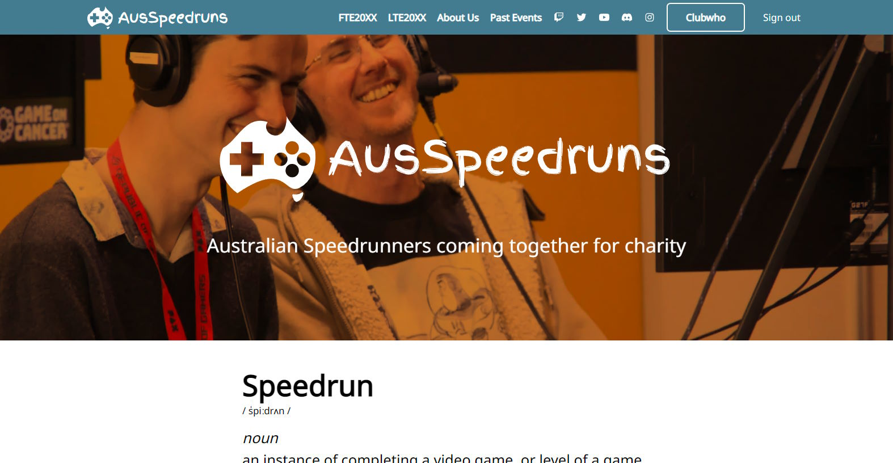
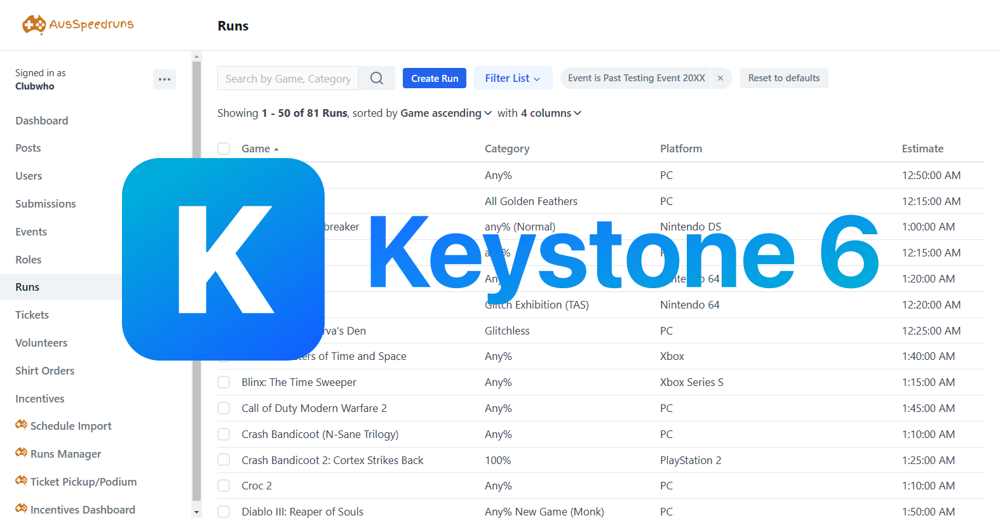

<br />
<div align="center">
  
  <br><br>
  <p><b>Monorepo for the <a href="https://ausspeedruns.com/" target="_blank">AusSpeedruns.com</a> website.</b></p>
</div>

## Table of Contents

- [Table of Contents](#table-of-contents)
- [Apps](#apps)
  - [NextJS](#nextjs)
  - [Keystone](#keystone)
- [Monorepo](#monorepo)
- [Setup](#setup)
- [Contributions](#contributions)

## Apps

- [NextJS (Front-end)](#nextjs)
- [Keystone (Back end)](#keystone)

### NextJS



To run the dev server type the command `yarn run nextjs` or call the nx command `nx run nextjs:serve`

### Keystone



To run the dev server type the command `yarn run keystone` or call the nx command `nx run keystone:serve`

## Monorepo

The monorepo uses [Nx](https://nx.dev/).

Keystone is built using a custom builder found in `libs/keystone-plugin/src/executors/execurtors.ts`.

## Setup

To setup the development materials you just need to clone the repo and then run `yarn`.

Full steps:

```console
git clone https://github.com/AusSpeedruns/ausspeedruns.com.git
cd ausspeedruns.com
yarn
```

There are a few assets related to sponsors, these require access to a private repo with those assets. The NextJS app will fail without these images, for the time being create a new folder in `apps/nextjs/styles/img/` called `sponsors` and just put a random image in multiple times with the required names the errors are giving you.

## Contributions

If you want to help out please message the `#new-website` channel on the [AusSpeedruns discord](http://discord.ausspeedruns.com/) about what you want to work on! From there we can collaborate on improving the website.
